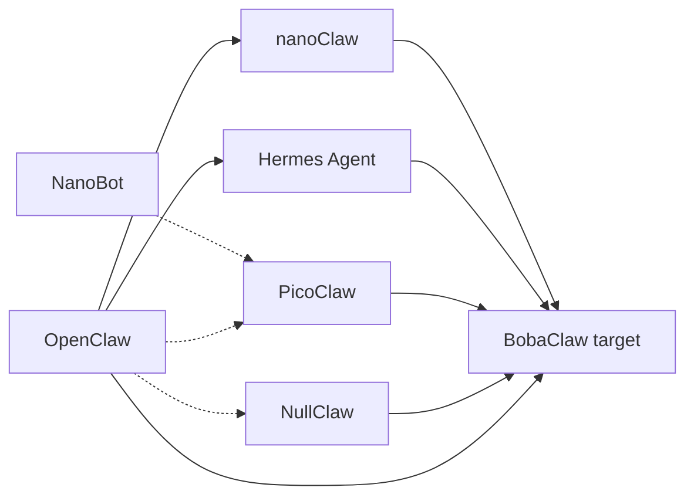
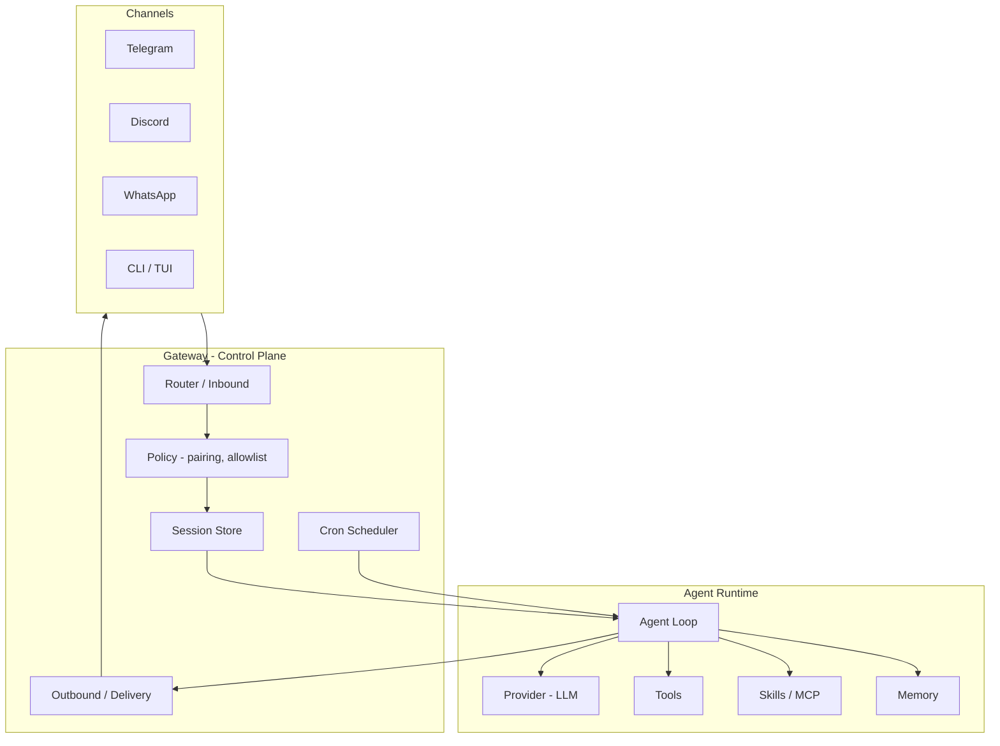
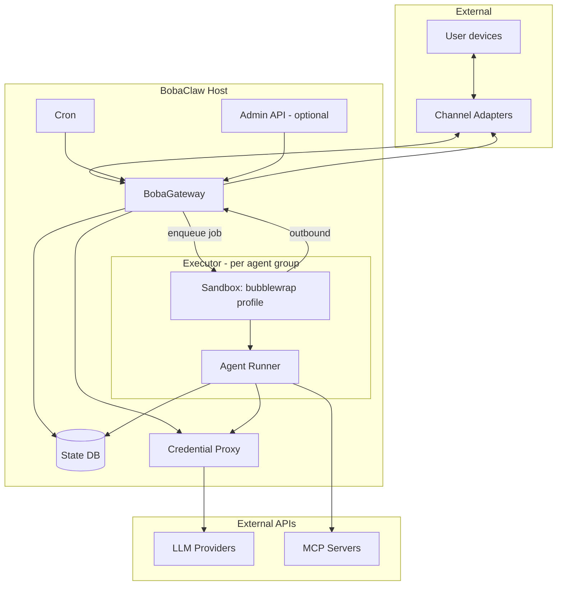
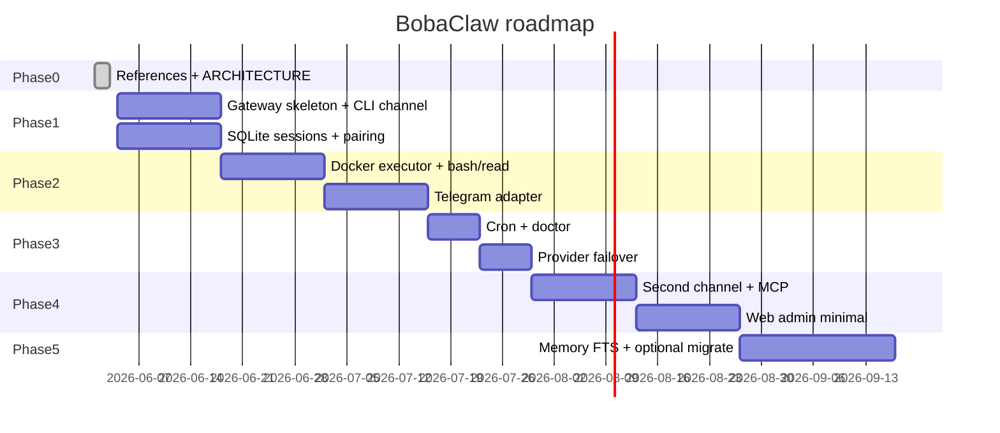

# Архитектура BobaClaw

**Статус:** implemented (MVP runtime на Rust)  
**Обновлено:** 2026-06-03  
**Аудитория:** ты как оператор/разработчик; агенты Cursor при доработке BobaClaw

---

## 1. Назначение документа

Этот документ фиксирует:

1. **Что такое BobaClaw** — личный AI-ассистент с gateway, не SaaS-бот.
2. **Что лежит в `references/`** — пять эталонных реализаций и их trade-off.
3. **Общую модель Claw** — компоненты, которые повторяются у всех.
4. **Целевую архитектуру BobaClaw** — как собрать своё, не копируя монолит OpenClaw целиком.
5. **Открытые решения и фазы** — что решить до первого коммита кода.

Runtime-код живёт в `crates/*` (Rust workspace). Реализация следует этому документу и ADR в `docs/adr/`; расхождения — через правку документа или новый ADR.

---

## 2. Цели и границы

### 2.1 Цели

| Цель | Критерий успеха |
|------|-----------------|
| **Личный ассистент** | Один оператор (ты); ответы в привычных мессенджерах и CLI |
| **Self-hosted** | Работа на homelab host или WSL; свои ключи |
| **Понятность** | Кодовая база, которую можно объяснить и аудировать за часы, не недели |
| **Безопасность** | Недоверенный ввод из DM; изоляция инструментов сильнее, чем один allowlist в процессе |
| **Расширяемость** | Каналы, провайдеры, skills/MCP без переписывания ядра |

### 2.2 Вне scope (v1)

- Публичный multi-tenant SaaS
- Маркетплейс skills уровня ClawHub
- Нативные macOS/iOS/Android **nodes** с Canvas/Voice Wake (как у OpenClaw) — отложить
- Автоматическое «самообучение» уровня Hermes (autonomous skill synthesis) — фаза 2+
- Поддержка всех 20+ каналов OpenClaw — только явно выбранные адаптеры

### 2.3 Не-цели

- Форк OpenClaw «как есть» — слишком большая поверхность и shared-memory модель
- Копирование бинарника NullClaw/PicoClaw без выбора стека — сначала модель, потом язык

---

## 3. Портфель референсов

```
references/
├── openclaw/      # TS, полный gateway + extensions + apps (~262 MB)
├── hermes-agent/  # Python, learning loop + migrate from OpenClaw (~157 MB)
├── nanoClaw/      # TS, host + Docker agent (~22 MB)
├── nullclaw/      # Zig, edge static binary (~46 MB)
└── picoClaw/      # Go, edge + WebUI (~41 MB)
```

### 3.1 Краткий профиль

| Репозиторий | Стек | Сильная сторона | Слабое / риск для BobaClaw |
|-------------|------|----------------|----------------------------|
| **OpenClaw** | Node/TS, pnpm | Каналы, UI, cron, multi-agent, ClawHub, документация | Размер, один процесс, app-level security |
| **Hermes** | Python, uv | Память, skills loop, `hermes claw migrate`, Modal/Daytona | Тяжелее nano, другой runtime |
| **nanoClaw** | Node + Docker/Bun | Изоляция агента, малый trunk, OneCLI Vault | Мало каналов out of box, «конфиг = код» |
| **NullClaw** | Zig | RAM/startup, vtable, 50+ providers в малом binary | Zig-экосистема, другой порог входа |
| **PicoClaw** | Go | Edge, MCP, routing, CN-каналы, WebUI | Быстрый рост PR, security maturity |

### 3.2 Родословная (концептуально)



BobaClaw **не обязан** быть потомком одного репо — он синтезирует паттерны.

---

## 4. Claw DNA — общая модель

Все референсы сводятся к одной схеме: **внешние каналы ↔ control plane ↔ agent runtime ↔ tools/memory**.



### 4.1 Обязательные подсистемы

| Подсистема | Ответственность | Есть у всех референсов |
|------------|-----------------|------------------------|
| **Gateway** | Долгоживущий процесс, маршрутизация, health | Да |
| **Channel adapter** | Нормализация сообщений (текст, вложения, reply) | Да (набор разный) |
| **Session** | Идентичность диалога, история, compact/reset | Да |
| **Agent loop** | LLM ↔ tools, streaming, interrupt | Да |
| **Provider** | Модели, auth, failover | Да |
| **Tools** | shell, files, web, delegate… | Да (набор разный) |
| **Security inbound** | DM pairing / allowlist | Да (OpenClaw самый формализованный) |
| **Automation** | Cron / scheduled prompts | Да (кроме минимальных срезов) |

### 4.2 Расхождения (где выбирать дизайн)

| Тема | Спектр в референсах | Рекомендация для BobaClaw |
|------|---------------------|---------------------------|
| **Где крутится агент** | Host process (OpenClaw) ↔ Docker per session (nano) ↔ static binary (null/pico) | **Host gateway + bubblewrap executor** (Docker — опционально позже) |
| **Конфиг** | JSON wizard (OC/Hermes/Pico) ↔ правка кода (nano) | **JSON/YAML для оператора** + небольшой `workspace/` для prompt-файлов |
| **Расширения** | Monorepo extensions / vtable / skills branches | **Плагины каналов** + **MCP** + каталог skills в workspace |
| **Память** | SQLite FTS, Honcho, JSONL, hybrid vectors | **SQLite FTS5 + markdown workspace** в v1; vectors — v2 |
| **UI** | Control UI, WebUI, TUI, none | **CLI + опциональный лёгкий Web** (статус, чат), без Canvas v1 |

---

## 5. Целевая архитектура BobaClaw

### 5.1 Принципы проектирования

1. **Gateway тонкий, агент тяжёлый** — gateway не выполняет shell; только оркестрация и политики.
2. **Fail closed на DM** — неизвестный отправитель не попадает в agent loop без pairing.
3. **Один writer на сессию** — избегать гонок как в nanoClaw (inbound/outbound очереди).
4. **Секреты не в sandbox** — ключи на host или vault-sidecar; агент получает прокси (идея OneCLI / gateway proxy).
5. **Минимальный trunk** — каналы и «тяжёлые» интеграции — отдельные модули/пакеты.
6. **Наблюдаемость с первого дня** — структурные логи, метрики gateway (совместимо с Prometheus на operator host).

### 5.2 Логическая диаграмма (target)



### 5.3 Поток сообщения (happy path)

1. **Inbound:** адаптер канала → нормализованное `InboundMessage` (channel, peer, text, attachments, raw ids).
2. **Policy:** pairing / allowlist / group rules → drop или `PendingPairing`.
3. **Route:** `(channel, peer, group)` → `AgentGroupId` + `SessionId` (таблица маршрутизации в DB).
4. **Persist:** append в session inbox (SQLite или файл-очередь).
5. **Wake:** scheduler поднимает или будит **Executor** для этой сессии (один runner на сессию).
6. **Run:** Agent Runner читает inbox, вызывает LLM, tools (через sandbox API), пишет в outbox.
7. **Outbound:** gateway poll/dispatch → адаптер → канал.
8. **Ack:** пометка доставки, compaction по политике.

### 5.4 Модель изоляции (три уровня)

Вдохновлено [nanoClaw isolation model](references/nanoClaw/docs/isolation-model.md) и OpenClaw sandbox modes.

| Уровень | Сущность | Изоляция | Пример |
|---------|----------|----------|--------|
| L1 | **Operator** | Host, secrets, gateway | Operator host (homelab) |
| L2 | **Agent group** | Workspace dir, memory namespace, executor image | «Дом», «Работа» |
| L3 | **Session** | Очередь сообщений, история turn-ов | DM с Telegram @user |

Правило: **инструменты с побочными эффектами только в L2 sandbox**, не в процессе gateway.

---

## 6. Компоненты (спецификация)

### 6.1 BobaGateway

| Аспект | Спецификация |
|--------|--------------|
| **Роль** | Control plane: каналы, сессии, cron, pairing, доставка |
| **Не делает** | Прямой вызов LLM, shell на хосте от имени пользователя |
| **Интерфейсы** | Unix socket / HTTP localhost для Admin; внутренний gRPC/JSON-RPC к Executor (TBD) |
| **Состояние** | SQLite: sessions, routes, pairing, cron, outbox |
| **Демон** | systemd user/unit на Linux; аналог launchd при необходимости |
| **Референс** | OpenClaw `gateway`, PicoClaw gateway, Hermes `hermes gateway` |

**Команды (целевые):**

```text
bobaclaw onboard          # wizard: workspace, provider, первый канал
bobaclaw gateway start|stop|status
bobaclaw pairing approve <channel> <code>
bobaclaw chat                    # интерактивный REPL (readline, /help, /new)
bobaclaw agent --message "..."   # одиночное сообщение CLI
bobaclaw doctor                  # misconfig, risky DM policies
```

### 6.2 Channel Layer

**Контракт адаптера:**

```typescript
// Концептуальный контракт (язык реализации TBD)
interface ChannelAdapter {
  id: string;                          // "telegram", "discord", ...
  start(ctx: GatewayContext): Promise<void>;
  stop(): Promise<void>;
  send(out: OutboundMessage): Promise<DeliveryResult>;
  onMessage(handler: (msg: InboundMessage) => void): void;
}
```

**Приоритет каналов v1:**

| Приоритет | Канал | Зачем |
|-----------|-------|-------|
| P0 | CLI / TUI | Отладка без мессенджера |
| P0 | Telegram | Основной remote с телефона |
| P1 | Discord или Slack | По необходимости |
| P2 | WhatsApp | Сложнее (Baileys и т.д.) |
| P3 | Matrix, Email | Homelab / уведомления |

Реализации смотреть в `references/openclaw/extensions/*`, `references/picoClaw/docs/channels/*`, `references/hermes-agent` gateway.

### 6.3 Session & Routing

| Поле | Описание |
|------|----------|
| `session_id` | UUID, стабилен для пары channel+peer (+ thread) |
| `agent_group_id` | Workspace + executor + memory scope |
| `history` | Turn-based messages; лимит токенов → `/compact` |
| `thinking` | optional level (как OpenClaw `/think`) |

**Маршрутизация (пример config):**

```yaml
routing:
  - match: { channel: telegram, peer: "*" }
    agent_group: home
  - match: { channel: discord, guild: "my-server" }
    agent_group: work
```

Референс: OpenClaw multi-agent routing, PicoClaw routing-system.

### 6.4 Agent Runner (Executor)

| Аспект | Спецификация |
|--------|--------------|
| **Вход** | Inbox queue, system prompt files, tool manifest |
| **Цикл** | LLM stream → tool calls → repeat until stop или interrupt |
| **Прерывание** | Новое inbound сообщение → cancel current turn (Steering, см. PicoClaw) |
| **Sandbox** | **bubblewrap** (`bwrap-default`) по умолчанию; `host-danger` только с approval |
| **Run Ledger** | Source of truth: `runs` + `run_events` в `state.db`, артефакты в `runs/<id>/` |
| **Tools v1** | Ephemeral **command capsules** (bash/python/node scripts), skills, LLM answer-only |

Референс runner: nanoClaw container agent-runner, OpenClaw embedded agent, Hermes agent loop.

### 6.5 Provider Layer

| Требование | Детали |
|------------|--------|
| Формат | OpenAI-compatible + native Anthropic (минимум один) |
| Auth | env + config file; ротация без рестарта gateway (reload) |
| Failover | secondary model в config (OpenClaw model-failover) |
| Routing | Правила «лёгкая модель для коротких запросов» (PicoClaw) — v2 |

### 6.6 Memory & Workspace

**Layout на диске (целевой):**

```text
~/.bobaclaw/
├── config.yaml
├── state.db              # Hermes-like: sessions, messages, FTS, ledger
├── runs/                 # scripts, stdout, stderr, result.json per run
├── workspace/
│   ├── home/
│   │   ├── BOBACLAW.md
│   │   ├── SOUL.md       # опционально, persona
│   │   ├── skills/
│   │   └── memory/
│   └── work/
│       └── ...
└── pairing/
```

| Механизм | v1 | v2 |
|----------|----|----|
| Prompt injection | BOBACLAW.md, TOOLS.md | — |
| Long-term notes | markdown в `memory/` | — |
| Session search | SQLite FTS на транскриптах | embeddings |
| User model | — | Honcho-совместимый или свой лёгкий профиль |

Референс: OpenClaw workspace, Hermes memory docs, NullClaw hybrid memory.

### 6.7 Skills & MCP

| Источник возможностей | Когда |
|-----------------------|-------|
| **Workspace skills** | `skills/<name>/SKILL.md` (agentskills.io) |
| **MCP servers** | Конфиг списка серверов; gateway не обязан быть MCP host — runner может |
| **Built-in tools** | Ядро executor |

Не тащить ClawHub в v1; импорт skills — копирование в workspace (как Hermes openclaw-imports).

**Skill Forge (v1):** `bobaclaw skills draft-from-run`, guard-аудит, `promote` в `skills/<name>/`. Авто-предложения — фаза 2.

### 6.8 Cron & Automation

```yaml
cron:
  - id: monday-briefing
    cron: "0 9 * * 1"
    agent_group: home
    prompt: "Сводка новостей AI за неделю"
    deliver:
      channel: telegram
      peer: "<owner>"
```

Gateway будит executor по расписанию; результат → outbound. Референс: OpenClaw cron-jobs, Hermes cron, nanoClaw scheduled tasks.

### 6.9 Security

| Угроза | Митигация |
|--------|-----------|
| Незнакомый DM | `dm_policy: pairing` по умолчанию; код + `bobaclaw pairing approve` |
| Prompt injection из чата | System rules; tool allowlist; no raw shell on gateway |
| Утечка ключей | VAULT proxy; sandbox без env с API keys |
| Remote exposure | Только Tailscale/локальная сеть; runbook перед 0.0.0.0 |
| Supply chain skills | Ручной импорт; опционально hash/signature позже |

Референс: OpenClaw security + exposure runbook, PicoClaw `.security.yml`, Hermes command approval.

### 6.10 Observability

| Сигнал | Куда |
|--------|------|
| Structured logs | stdout → journald / Loki |
| Metrics | Prometheus: `gateway_up`, `sessions_active`, `executor_run_duration` |
| Health | `GET /health` на Admin API |

Стыкуется с существующим observability stack оператора (Prometheus/Grafana/Loki).

---

## 7. Матрица заимствований

Что брать из каждого референса при реализации BobaClaw:

| Компонент | Primary | Secondary | Избегать |
|-----------|---------|-----------|----------|
| Gateway protocol | OpenClaw docs | PicoClaw gateway | Весь monorepo extensions сразу |
| Docker isolation | nanoClaw | OpenClaw sandbox | Shared-memory single Node для tools |
| DM pairing UX | OpenClaw | Hermes security | `dm_policy: open` по умолчанию |
| CLI / doctor | OpenClaw + Hermes | — | — |
| MCP | PicoClaw + Hermes | OpenClaw MCP serve | — |
| Model routing | PicoClaw | OpenClaw failover | — |
| Memory loop | Hermes (фаза 2) | NullClaw SQLite hybrid | Полный Honcho в v1 |
| Edge deploy | PicoClaw / NullClaw | — | Перенос на Zig до обоснования |
| Credential proxy | nanoClaw OneCLI idea | — | Ключи в контейнере |
| Migrate from OpenClaw | Hermes `claw migrate` | — | — |

---

## 8. Стек реализации (зафиксирован)

**Решение:** Rust workspace — см. [adr/001-rust-runtime.md](adr/001-rust-runtime.md).

| Слой | Технология |
|------|------------|
| CLI / binary | `bobaclaw` (`clap`) |
| Gateway | `axum`, `/health`, `/v1/chat/completions`, `/api/agent` |
| State | SQLite WAL `state.db` — см. [adr/002-state-and-run-ledger.md](adr/002-state-and-run-ledger.md) |
| Executor | bubblewrap profiles — см. [adr/003-executor-profiles.md](adr/003-executor-profiles.md) |
| LLM | OpenAI-compatible HTTP |
| Skills | Hermes-like `SKILL.md` + Skill Forge — [adr/004-skill-forge.md](adr/004-skill-forge.md) |

**Первый milestone:** `OPENAI_API_KEY` → `bobaclaw init` → `bobaclaw agent --message "..."` → ответ модели.

---

## 9. Фазы внедрения



| Фаза | Результат | Критерий готовности |
|------|-----------|---------------------|
| **0** | Референсы + этот документ | — |
| **1** | `bobaclaw` + CLI + gateway MVP | Сообщение в CLI → ответ LLM; `state.db`; bwrap capsules |
| **2** | Telegram + pairing | DM с pairing; execution только через profiles |
| **3** | Cron, doctor, config reload | Задача по расписанию приходит в Telegram |
| **4** | MCP, второй канал, metrics | Prometheus scrape, один MCP tool работает |
| **5** | Memory search, import OpenClaw | `bobaclaw migrate --from openclaw` dry-run |

---

## 10. Структура репозитория (целевая)

Не смешивать runtime с `references/`:

```text
bobaClaw/
├── Cargo.toml
├── crates/
│   ├── bobaclaw/            # CLI binary
│   ├── bobaclaw-core/
│   ├── bobaclaw-state/
│   ├── bobaclaw-provider/
│   ├── bobaclaw-executor/
│   ├── bobaclaw-agent/
│   ├── bobaclaw-gateway/
│   ├── bobaclaw-skills/
│   └── bobaclaw-skill-forge/
├── migrations/
├── docs/adr/
├── references/              # read-only upstream
└── workspace-examples/
```

---

## 11. Глоссарий

| Термин | Значение |
|--------|----------|
| **Gateway** | Control plane BobaClaw на хосте |
| **Channel** | Адаптер внешнего мессенджера |
| **Agent group** | Workspace + политики + executor |
| **Session** | Один логический диалог |
| **Executor** | Sandbox (bubblewrap), где выполняются capsules |
| **Run Ledger** | Аудируемая история runs; source of truth для статуса |
| **Command capsule** | Сохранённый script + manifest до запуска |
| **Skill Forge** | Автосоздание skills из успешных runs (Hermes-like) |
| **Pairing** | Подтверждение незнакомого DM |
| **Claw DNA** | Общий набор подсистем у *Claw проектов |

---

## 12. Ссылки

| Проект | Upstream |
|--------|----------|
| OpenClaw | https://github.com/openclaw/openclaw · https://docs.openclaw.ai |
| Hermes Agent | https://github.com/NousResearch/hermes-agent · https://hermes-agent.nousresearch.com/docs/ |
| nanoClaw | https://github.com/nanocoai/nanoclaw · https://docs.nanoclaw.dev |
| NullClaw | https://github.com/nullclaw/nullclaw · https://nullclaw.github.io |
| PicoClaw | https://github.com/sipeed/picoclaw · https://docs.picoclaw.io |

Локальные пути: `references/<name>/`.

---

## 13. История изменений

| Дата | Изменение |
|------|-----------|
| 2026-06-03 | Первая версия: портфель референсов, Claw DNA, целевая архитектура, фазы |
| 2026-06-03 | Rust MVP: workspace, state.db, bwrap executor, gateway, Skill Forge |
