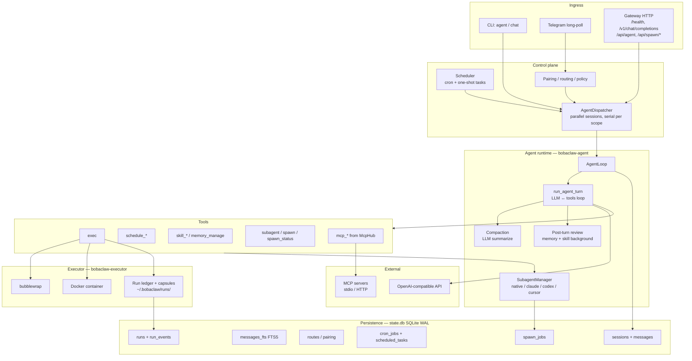

# BobaClaw: as-built architecture and feature list

**Status:** factual snapshot of runtime code (not roadmap)  
**Updated:** 2026-06-09  
**Audience:** operators and contributors  
**Related:** [ARCHITECTURE.md](ARCHITECTURE.md) (target design), [features.md](features.md) (comparison vs references — partially stale on subagents)

This document describes what is **actually implemented** in `crates/`. Where it diverges from [features.md](features.md), trust this file.

---

## Architecture (as implemented)



### Message flow (happy path)

1. **Ingress** → `NormalizedRequest` (CLI / Telegram / REST / OpenAI-compat).
2. **Policy** (Telegram): pairing / allowlist / group rules → drop or pairing code.
3. **Routing**: `(channel, peer) → agent_group` from `config.yaml`.
4. **Session**: `SessionStore.resolve_session()` — history in SQLite.
5. **Dispatcher**: up to `max_parallel_turns` sessions in parallel; serialized within one scope; a new message **preempts** the in-flight turn (steering-like).
6. **Turn**: system prompt + history → LLM tool loop → sandbox `exec` / MCP / schedule / subagent.
7. **Persist**: assistant message + `<!-- tool-results -->` appendix.
8. **Background**: post-turn memory/skill review (async, Hermes-style).
9. **Outbound**: Telegram edit/stream or CLI outbox for scheduled delivery.

### Rust workspace (13 crates)

| Crate | Role |
|-------|------|
| `bobaclaw` | CLI binary (`clap`) |
| `bobaclaw-core` | Config, paths, routing, policy, request types, subagent config |
| `bobaclaw-state` | SQLite: sessions, runs, pairing, cron, spawn_jobs |
| `bobaclaw-provider` | OpenAI-compatible chat + tool calling |
| `bobaclaw-executor` | Sandbox: bubblewrap / Docker, run ledger |
| `bobaclaw-agent` | Agent loop, tools, compaction, subagents, review |
| `bobaclaw-gateway` | axum HTTP server |
| `bobaclaw-channel-telegram` | Telegram adapter |
| `bobaclaw-scheduler` | Cron + delayed tasks |
| `bobaclaw-skills` | `SKILL.md` registry, guard, enable/disable |
| `bobaclaw-skill-forge` | draft-from-run → promote |
| `bobaclaw-mcp` | MCP hub (rmcp), prefixed tools |

### On-disk layout

```text
~/.bobaclaw/
├── config.yaml
├── state.db
├── runs/<run_id>/          # capsules, stdout/stderr
├── outbox/                 # CLI scheduled delivery
├── workspace/<group>/
│   ├── BOBACLAW.md, SOUL.md, MEMORY.md, TOOLS.md
│   ├── skills/, skills-staging/, memory/
│   └── inbox/telegram/...  # downloaded attachments
└── scheduler.pid           # daemon mode
```

---

## Feature list (implemented)

### CLI and operator

| Feature | Command / mechanism |
|---------|---------------------|
| Workspace init | `bobaclaw init` — config + seed from `workspace-examples/home` |
| Health check | `bobaclaw doctor` — API key, bwrap/docker, MCP, telegram, scheduler |
| Single message | `bobaclaw agent --message "..."` |
| REPL | `bobaclaw chat` — readline, history, markdown render |
| CLI slash commands | `/help`, `/new`, `/session`, `/compact`, `/stop`, `/subagents`, `/skills`, `/doctor`, `/quit` |
| Gateway | `bobaclaw gateway start` → `127.0.0.1:18790` |
| Skills CLI | `list`, `view`, `enable`, `disable`, `drafts`, `guard`, `draft-from-run`, `promote` |
| Pairing | `pairing list/approve` |
| Schedule CLI | `schedule list/cancel` |
| Scheduler daemon | `scheduler start` (pidfile, Ctrl+C) |

### Gateway HTTP API

| Endpoint | Purpose |
|----------|---------|
| `GET /health` | Liveness |
| `POST /v1/chat/completions` | OpenAI-compatible (non-streaming) |
| `POST /api/agent` | `{ message, agent_group? }` |
| `POST /api/agent/interrupt` | Interrupt turn by scope |
| `GET /api/spawn/jobs?session_id=` | List background spawn jobs |
| `GET /api/spawn/jobs/{id}` | Spawn job details |

Gateway also **automatically** starts Telegram long-poll and in-process scheduler when enabled in config.

### Channels

**Telegram only** (`bobaclaw channel telegram start` or via gateway):

- Long-poll, webhook cleanup
- DM policies: `pairing` / `allowlist` / `open`
- Group policies: `allowlist` / `open` / `disabled` + `group_require_mention`
- Pairing flow: `/pair`, `/start` → code → `bobaclaw pairing approve`
- Streaming UX: `editMessageText` at `stream_edit_interval_ms`
- Markdown → Telegram HTML (`format: html | plain`)
- Proxy (HTTP/SOCKS5) for Bot API
- Media into workspace: photo, document, voice, audio, video → `inbox/telegram/...`
- Slash: `/new`, `/stop`, `/subagents`, `/help`
- Bot commands registration (`setMyCommands`)

**CLI** — full channel with sessions and outbox for scheduled messages.

### Agent loop

- LLM ↔ tools loop up to `max_tool_iterations` (default 60)
- Nudges on empty replies (`max_action_retries`, `max_empty_response_retries`)
- **Interrupt / steering**: new message in the same scope cancels the current turn; `/stop`, Ctrl+C, `/api/agent/interrupt`
- Parallelism: `max_parallel_turns` (default 4) across different sessions
- Tool results persisted in history with `<!-- tool-results -->` marker
- Leaked tool XML filtered from model output
- System prompt: identity, agent loop, tool discipline, memory/skills/scheduling/subagent hints + workspace files (`BOBACLAW.md`, `SOUL.md`, `MEMORY.md`, skills index)

### Context / compaction

- Token estimation; proactive compaction before LLM call at `pre_call_compact_ratio: 0.8`
- LLM summarize of older messages (Hermes/OpenClaw pattern)
- Manual `/compact` in CLI
- Config: `context_window_tokens`, `reserve_tokens`, `keep_recent_messages`

### Tools (parent agent)

| Tool | Behavior |
|------|----------|
| `exec` | Shell in sandbox (bwrap/docker), run ledger, head/tail truncation |
| `schedule` | One-shot delayed task (up to 7 days) |
| `schedule_recurring` | Cron-style repeat (5-field cron) |
| `schedule_list` / `schedule_cancel` | Task management |
| `skill_manage` | create/patch/edit/delete/write_file skills |
| `skill_view` / `skills_list` | Read skills |
| `memory_manage` | append to `MEMORY.md` / `memory/*` |
| `subagent` | Synchronous delegation to isolated child loop |
| `spawn` | Fire-and-forget background subagent |
| `spawn_status` | Spawn job status |
| `mcp_<server>_<tool>` | Dynamic from MCP config |

**Child subagent** gets: `exec`, `skill_view`, `skills_list`, MCP (filtered by preset allowlist). No schedule, memory, or nested subagent tools.

### Subagents

| Backend | Status |
|---------|--------|
| `native` (default) | In-process tool loop, separate system prompt, semaphore concurrency |
| `claude_code` | CLI via sandbox (`claude --bare -p`) |
| `codex` | CLI via sandbox (`codex exec`) |
| `cursor` | Wrapper `scripts/cursor-subagent-wrapper.py` |

Config: `max_depth`, `max_concurrent`, presets (model, tools_allowlist, system_extra), spawn feedback (notify, wake parent, rate limit).

Spawn completion: notification to Telegram/CLI; optional wake of parent turn.

### Executor / sandbox

| Backend | Details |
|---------|---------|
| **bubblewrap** | Default on Linux; network toggle; `sandbox_packages` for apt |
| **Docker** | Default on macOS; image `bobaclaw/sandbox:latest`, named container |
| Run ledger | `runs` + `run_events` in DB; artifacts under `~/.bobaclaw/runs/` |
| Profiles | `bwrap-default`, networked, readonly; **`host-danger` — bail, not implemented** |

### Scheduler / automation

- Config cron jobs (`cron.jobs[]`) with delivery to Telegram/CLI
- Agent-created one-shot tasks (`scheduled_tasks` table)
- In-process scheduler in gateway + telegram (when `scheduler.enabled`)
- Embedded scheduler in `chat` (when `scheduler.embedded: true`)
- Foreground daemon with pidfile (`scheduler start`)
- Delivery: Telegram message or CLI outbox file

### Memory and skills

| Mechanism | Status |
|-----------|--------|
| Workspace markdown | `MEMORY.md`, `memory/`, injected into prompt |
| `memory_manage` tool | append only, size limits |
| Background memory review | every 10 user turns (async LLM) |
| Skills (agentskills.io) | `SKILL.md`, enable/disable, agent create via tool |
| Background skill review | after 10+ tool calls in one turn |
| Skill Forge | `draft-from-run` → staging → `promote` |
| Guard audit | `skills guard <path>` — static audit |

### MCP

- Transports: **stdio** (subprocess, incl. Docker Obscura) and **HTTP** (streamable)
- Prefixed tool names: `mcp_<server>_<tool>`
- Allowlist/denylist per server
- Docker MCP container cleanup on drop
- Doctor checks connectivity

### State DB (SQLite WAL)

| Table | Usage |
|-------|-------|
| `sessions`, `messages` | Dialog history |
| `messages_fts` | FTS5 + triggers (**schema only — no search API**) |
| `runs`, `run_events` | Run ledger |
| `approvals` | **Schema only — flow not implemented** |
| `routes` | channel+peer → agent_group+session |
| `pairing` | DM pairing codes |
| `cron_jobs`, `cron_runs` | Recurring automation |
| `scheduled_tasks` | One-shot agent schedules |
| `skill_drafts` | Skill Forge staging |
| `spawn_jobs` | Background subagent tracking |

### Provider

- **Single** OpenAI-compatible HTTP provider (`base_url`, `api_key_env`, `model`)
- Tool calling via `bobaclaw-provider`
- Subagents may use separate `subagents.model`
- **Not implemented:** failover, client-side streaming, Anthropic native, model routing

### Harness / CI

- Contracts in `harness/tools/` (exec, schedule, memory, skills, mcp, subagent)
- `make ci`, evals smoke, migration checks, integration scripts

---

## Scaffolding / not implemented

| Item | Where |
|------|-------|
| FTS search API / CLI | `memory_search` tool; no `bobaclaw search` CLI yet |
| Approval flow | `approvals` table, `host-danger` profile |
| `bobaclaw onboard` wizard | spec in ARCHITECTURE only |
| Second+ channel (Discord/Slack/…) | no crate |
| Built-in `web_search` | none |
| Built-in `web_fetch` | optional (`tools.web_fetch.enabled`, default off); MCP still primary for JS pages |
| Dedicated file tools (read/write/edit) | `file_read`, `file_write`, `file_edit` |
| Run output recall | `run_view` tool |
| Credential vault / proxy | keys in env/config; external subagent backends export keys into sandbox |
| Web UI / control panel | none |
| systemd unit / hot reload | none |
| Prometheus metrics | none |
| `bobaclaw migrate --from openclaw` | none |
| LLM streaming in gateway/CLI | non-streaming only |
| Multi-model failover | none |

---

## Positioning summary

BobaClaw is a **working self-hosted MVP** with full Claw DNA core:

- Gateway + CLI + Telegram
- Sandbox exec (bwrap/docker)
- SQLite sessions + run ledger
- Cron + agent scheduling
- MCP extensibility
- Skills + memory + background review
- Subagents (sync + async spawn)

Main gaps vs references (OpenClaw/Hermes/PicoClaw):

1. **Channel breadth** — one channel vs 6–20+ in references
2. **Operator UX** — no wizard, Web UI, systemd
3. **Resilience** — single provider, no failover or streaming
4. **Security** — bwrap exists; no vault, approvals, or host-danger
5. **Tool surface** — no built-in web/file/browser tools (MCP + exec instead)
