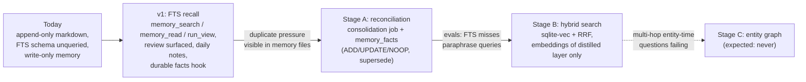

# Memory beyond FTS — survey and roadmap (ADR 005 follow-up)

Status: research note, June 2026. Companion to [ADR 005](adr/005-memory-architecture.md), which defines the v1 tiered model (FTS5 recall, curated markdown, F13 integrity). This note answers: **what comes after FTS**, based on how production agent-memory systems work and what is worth borrowing for a local-first Rust runtime.

## Systems surveyed

| System | Substrate | Write path | Read path | Key idea |
|--------|-----------|------------|-----------|----------|
| **Letta (MemGPT)** | Tiered: core (in-context blocks) / recall (history) / archival (external) | Low cost; agent self-manages via tools | Tool calls, no LLM in core read | Agent-visible memory management; **sleep-time agents** consolidate in background |
| **Mem0** | Vector + KV (+ optional graph) | High: LLM fact extraction per turn; update phase picks ADD/UPDATE/DELETE/NOOP vs similar memories | Vector search | **Distill at write**; dedupe/contradiction resolution before storing |
| **Zep / Graphiti** | Bi-temporal knowledge graph + vector + BM25, RRF fusion | Very high: entity/relation extraction + bi-temporal stamping per episode | Graph traversal + RRF, no LLM | **Facts have validity windows**; contradictions invalidate (not delete) old edges; everything traces to source episodes |
| **OMEGA / vstash class** | Single SQLite file: FTS5 + sqlite-vec, RRF | Low | Hybrid BM25 + vector, RRF (k≈60), optional IDF-adaptive weights, recency | **Local-first hybrid search is enough** for strong LongMemEval scores; no external services |

Reference points: Letta sleep-time docs (`docs.letta.com`), Mem0 paper (arXiv:2504.19413), Zep paper (arXiv:2501.13956), sqlite-vec hybrid-search pattern (Alex Garcia), Rust crates in this space (`semantic-memory`: SQLite + FTS5 + RRF + optional HNSW sidecar).

## What to borrow

### 1. Letta: split "talking agent" from "memory agent" (sleep-time pattern)

Letta's primary agent **cannot** edit core memory; a background sleep-time agent with extra tools (`memory_replace`, `memory_rethink`) consolidates asynchronously every N turns. BobaClaw already has the embryo: post-turn review (`review.rs`, every 10th message) and the planned consolidation job (memory-system-v2 plan).

**Borrow:** formalize the asymmetry. The in-turn agent keeps append-only `memory_manage`; the consolidation job becomes a proper memory agent with rewrite rights (replace/merge/demote), running through the F13 gate. Letta's labeled memory blocks with character limits are structurally identical to our injected workspace files with caps — validation that "injection is a cache" scales.

**Skip:** the full OS-paging runtime; benchmark write-ups consistently note the agentic-loop overhead does not pay off for simple tasks.

### 2. Mem0: update phase before write (ADD/UPDATE/NOOP)

Mem0's core contribution is not vectors — it is the **update phase**: before storing a candidate fact, retrieve the most similar existing memories and let the model decide ADD (new), UPDATE (supersede), or NOOP (duplicate). This is exactly the dedupe/supersede logic our consolidation job needs; without it, append-only memory accumulates contradictions and duplicates.

**Borrow:** run candidate facts (from `memory_manage`, review, and compaction "Durable facts") through a search-before-write step inside consolidation. Notably Mem0 v3 moved to ADD-only writes + retrieval-side ranking for latency — which validates ADR 005's choice: keep the hot path append-only, do reconciliation in the background.

**Skip:** LLM extraction on every turn (write-path cost; our review/compaction hooks already batch this).

### 3. Zep/Graphiti: bi-temporal facts and invalidation — without the graph

Zep's durable insight: a fact has a **validity window** (`valid_from` / `invalid_at`) distinct from when it was recorded, contradictions **invalidate rather than delete**, and every fact traces to its source episode. This solves the worst failure mode of markdown memory: stale facts ("user works at X") that nothing ever retires.

**Borrow (lightweight):** a `memory_facts` table in `state.db` — `id, text, valid_from, invalid_at, source (message_id/run_id/file), hash` — written by consolidation, searched by `memory_search`, rendered into `MEMORY.md` sections ("current" vs omitted-but-searchable "superseded"). This composes naturally with the F13 hash chain.

**Skip:** the full temporal knowledge graph. The write path is very expensive (entity + relation extraction per episode; reported ~600k tokens of memory footprint per conversation vs ~1.8k for Mem0), retrieval after ingestion lags until background processing completes, and the reference deployment wants Neo4j. Wrong trade-off for a homelab single-binary runtime. Reconsider only if evals show multi-hop entity questions ("who owned X in February") actually failing.

### 4. Local hybrid search: FTS5 + sqlite-vec + RRF

The proven "after FTS" retrieval upgrade that keeps the local-first constraint: add a `vec0` virtual table (sqlite-vec) next to `messages_fts`, run both queries, fuse with Reciprocal Rank Fusion (`score = Σ 1/(k + rank)`, k≈60), optionally weight by recency. Single SQLite file, no services; OMEGA/vstash-class systems show this is competitive on LongMemEval. Rust prior art exists (`semantic-memory` crate: SQLite + FTS5 + RRF + optional HNSW sidecar, SQLite authoritative).

**Borrow:** hybrid `memory_search` behind a config flag (off by default per backlog global rules). Embed **only the small curated corpus first** — memory facts, `memory/` files, compaction summaries — not every message; FTS already covers verbatim transcript recall, and embedding the transcript stream is where costs explode.

**Open choice:** embedding source — provider API (simple, leaves the local-first envelope for memory content) vs a local model (ONNX/llama.cpp embedding, true zero-cloud). Decide via config, default local-capable.

## Roadmap after FTS

Each stage gated on evidence from the previous one, not implemented speculatively:

| Stage | What | Trigger to start |
|-------|------|------------------|
| **A. Reconciling consolidation** | Mem0-style search-before-write (ADD/UPDATE/NOOP) inside the consolidation job; bi-temporal-lite `memory_facts` table with supersede-not-delete | Consolidation job (memory-system-v2 item 4) lands and dedupe pressure is visible in memory files |
| **B. Hybrid recall** | sqlite-vec + RRF in `memory_search` over facts/curated files/summaries; config-gated, local embeddings preferred | Recall evals show FTS missing paraphrase/synonym queries that the agent then answers wrongly |
| **C. Entity/temporal graph** | Graphiti-style entities + relations | Only if evals show multi-hop entity-time questions failing despite A+B; expect "never" for current product scope |

## Explicitly not borrowing

- **Neo4j / external graph or vector DB** — violates single-binary local-first.
- **LLM extraction on every turn** (Mem0 classic write path, Zep ingestion) — token cost lands on the operator; our batched review/compaction hooks are the budget-bounded equivalent.
- **Cloud memory services** (Mem0 Cloud, Zep Cloud, Cloudflare Agent Memory) — memory content is the most sensitive data the runtime holds; it stays on the host.
- **Per-message embeddings** — Run Ledger + `run_view` + FTS already give exact recall of raw history; embeddings are reserved for the distilled layer.

## Eval hooks (to make the triggers measurable)

- Recall suite in `evals/`: fact saved in session A, paraphrased query in session B (FTS-hard: synonym/translation cases for stage B trigger).
- Contradiction case: fact superseded in later session; correct answer must reflect the newer fact (stage A trigger).
- Multi-hop entity-time case (stage C trigger; expected to stay green with A+B).
